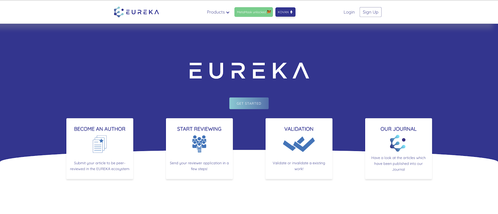

Implementation of a blockchain-based rating-publishing system. The EUREKA
ecosystem is a scientific rating-publishing platform with the Ethereum
blockchain as main infrastructure. EUREKA exploits blockchain technology and
smart contracts to enable a more efficient and trustworthy publishing process by
introducing time stamping for discoveries, rewarding reviewers, editors and
referenced authors and decentralising publishing. The EUREKA Token (EKA) is a
utility token and is a ERC20 combined with ERC667 token, thus it will follow
token standards provided by the Ethereum protocol, meaning it can be sent and
received in transactions on the Ethereum ecosystem.

## Our Social Media
> Medium: https://medium.com/eureka-token/

> Twitter: https://twitter.com/TokenEureka/

> Facebook: https://www.facebook.com/TokenEureka/

> Instagram: https://www.instagram.com/tokeneureka/

> Linkedin: https://www.linkedin.com/company/eurekatoken/




## Website

> EUREKA token (EKA) description: https://eurekatoken.io


# Prerequisites
* node "^10.0" => https://nodejs.org/en/download/
* yarn "^1.13.0" => https://yarnpkg.com/lang/en/docs/install/
* mongoDB "4.0.3" => https://www.mongodb.com/download-center/community
* Ganache "^1.2.2" => https://truffleframework.com/ganache
* Chrome Browser "72.0" => https://www.google.com/chrome/
* Meta Mask (Chrome extension) "5.3.1" => https://metamask.io/
* In addition we recommend a GUI for MongoDB to better work with the DB, e.g. Robo 3T => https://robomongo.org/download

## Setup
1. Make sure all the prerequisites are prior installed
1. Run the following: 
     ```
    $ git clone git@github.com:eureka-blockchain-solutions/eureka-platform.git 
    $ cd eureka-platform
    $ yarn
 
    ```
1. Create & start MongoDB locally ==> see section "Create & start MongoDB locally"
1. Copy '.env-example' and name it '.env'
1. Provide the following mandatory environment variables in the .env file:
    ```
    $ DB_HOST=                          # host of DB (default: localhost)
    $ DB_NAME=                          # {DB_NAME} set before in the DB
    $ DB_USER=                          # {DB_USER} set before in the DB
    $ DB_PASSWORD=                      # {DB_PASSWORD} set before in the DB
     
    ```
1.  The following environment variables are not mandatory, but are needed to be able to use all functionalities implemented:
    ```
    $ AMAZON_SECRET_KEY=                # Amazon S3 Database Secret Key (Used for saving/providing dynamically resized Images)
    $ AMAZON_ACCESS_KEY=                # Amazon S3 Database Access Key (Used for saving/providing dynamically resized Images)
    $ SENDGRID_API_KEY=                 # Sendgrid API access key (Used for sending Mails to Platform Users)
    $ ETHEREUM_FULL_NODE_KOVAN=         # Address of SC in the Kovan Testnet (only needed when testing on Kovan Test network)    
    ```
1. You can either start a 'plain' platform by:
    ```
    $ yarn run gan-server
    ```
    or a predefined scenario by:
     ```
     $ yarn run scenario
     ```   
1. Build the front-end application in another console by:
    ```
    $ yarn run dev-start
    ```
1. Open the chrome browser on the default dev port: [http://localhost:3000/](http://localhost:3000/)

#### Create & start MongoDB locally

Create directory at:

> Windows:  `C:\data\db`

> Unix:     `data/db`

Start mondoDB service:
```
mongod
```

Connect to service:
```
mongo
```

Use a new DB:
```
use eurekaDB
```

Create a new DB admin:
```
db.createUser({
	user: "{DB_USER}",
	pwd: "{DB_ADMIN}",
	roles: [{
		role: "dbAdmin",
		db:"{DB_NAME}"
		}]
})
```
Insert something into the DB to save the DB:
```
db.testData.insert({"test": "test"})
```

Check created DB:
```
show dbs
```

#### Deploy Contracts to Ganache

```
npm run deploy-contracts
```

#### Build Server and connect the monitor...
##### ... to Ganache
```
npm run gan-server
```

##### ...to Kovan Network
```
npm run kov-server
```

> Default dev port: `http://localhost:8080/`

### Testing

```
npm run test
```
or 
```
npm run test-ci
```

#### Testing strategy
     
| Branch\ Test-type       | Unit test        | DB test  | SC Integration test |
| ----------------------- |:----------------:| --------:|--------------------:|
| **Local**               |        Yes       |   Yes    |        Yes          |
| **Dev**                 |        Yes       |   No     |        No           |
| **Test**                |        Yes       |   Yes    |        Yes          |
| **Master**              |        Yes       |   No     |        No           |

Testing is done with ava. Based on the branch (see table) only specific test-files are executed. (e.g. on 'dev' only the file NormalTests.js).
When new test-files are created the script in package.json needs to be updated.

```
"test-ci": "if [ \"${CIRCLE_BRANCH}\" = \"dev\" ]; then ava --serial ./test/NormalTests.js; elif [ \"${CIRCLE_BRANCH}\" = \"master\" ]; then ava --serial ./test/NormalTests.js; else ava --serial;fi"
```

## How to contribute

Pull requests welcome! Please include tests and follow the style conventions.
Run `npm test`to verify.

## Current Smart Contracts:

Token Contract Address (Kovan Testnet): `0xad9a8e2f14820f9c2a8f39bb501fba891f9f990a`

Platform Contract Address (Kovan Testnet): `0xad5d2e1a0a17be861dabcb3734c79bec688856ab`


### Contributors

```
Lucas Pelloni
Severin Wullschleger
Andreas Schaufelbühl
Thomas Bocek
Jonathan Burger
```

## License

This project is licensed under the MIT License.

## Acknowledgments
* EKA Blockchain Solutions GmbH
* ScienceMatters AG
* University of Zurich
* The noun project Icons (https://thenounproject.com)
* Creative Tim for open-source Argon design system (https://www.creative-tim.com/)
